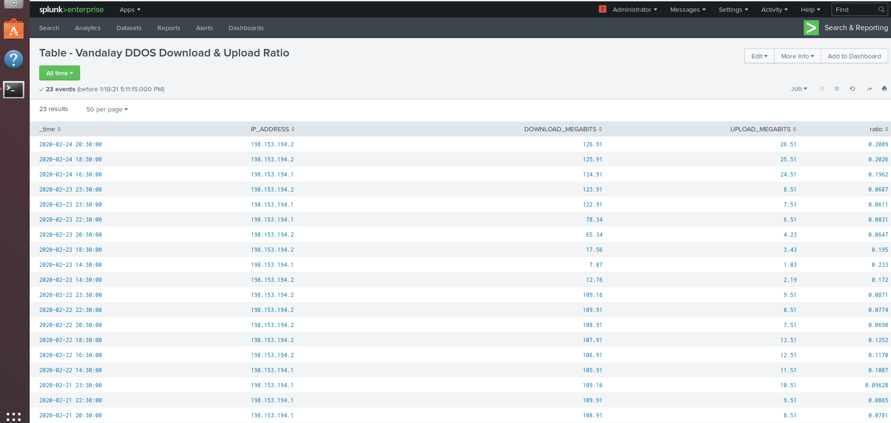
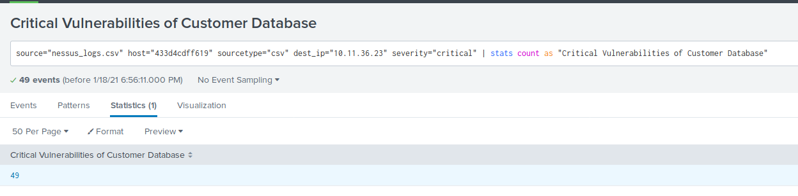
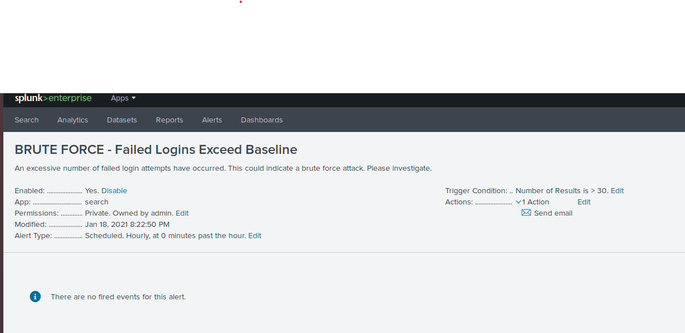

## Unit 18 Homework: Lets go Splunking!

### Step 1: The Need for Speed

Answer the following questions:

Based on the report created, what is the approximate date and time of the attack?
   - Attack began at 2020-02-23 2:30pm

How long did it take your systems to recover?
    - It took approximately 9 hours to recover, with a return to baseline at 2020-02-23 11:30pm

Submit a screen shot of your report and the answer to the questions above.

### Step 2: Are We Vulnerable?

Submit a screenshot of your report and a screenshot of proof that the alert has been created.

### Step 3: Drawing the (base)line

When did the brute force attack occur?
   - Friday 21st, 9am

Determine a baseline of normal activity and a threshold that would alert if a brute force attack is occurring.
   - Baseline is ~24 events per hour, threshold is defined as >30 events per hour.

Submit the answers to the questions about the brute force timing, baseline and threshold. Additionally, provide a screenshot as proof that the alert has been created.

