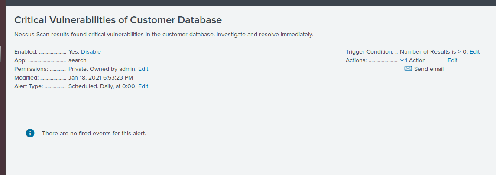

## Unit 18 Homework: Lets go Splunking!

In this unit we worked with Splunk as an SIEM tool. Splunk's powerful SPL (search processing language) allows for quick processing of huge amounts of security information. The homework tasked us with crafting our own SPL queries and then using those queries to build alerts and reports. Being able to create SPL queries allows us to gain deeper insights from our security event logs, easily share our findings with team members, and automate aspects of our security incident response. This deliverable contains a few analyses of the data provided and screenshots of my reports and alerts.

### Step 1: The Need for Speed

Answer the following questions:

Based on the report created, what is the approximate date and time of the attack?
   - Attack began at 2020-02-23 2:30pm

How long did it take your systems to recover?
   - It took approximately 9 hours to recover, with a return to baseline at 2020-02-23 11:30pm

Submit a screen shot of your report and the answer to the questions above.

### Step 2: Are We Vulnerable?

Submit a screenshot of your report and a screenshot of proof that the alert has been created.

### Step 3: Drawing the (base)line

When did the brute force attack occur?
   - Friday 21st, 9am

Determine a baseline of normal activity and a threshold that would alert if a brute force attack is occurring.
   - Baseline is ~24 events per hour, threshold is defined as >30 events per hour.

Submit the answers to the questions about the brute force timing, baseline and threshold. Additionally, provide a screenshot as proof that the alert has been created.

